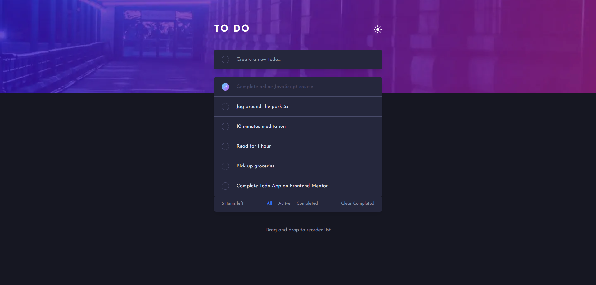

# Frontend Mentor - Todo app solution

This is a solution to the [Todo app challenge on Frontend Mentor](https://www.frontendmentor.io/challenges/todo-app-Su1_KokOW). Frontend Mentor challenges help you improve your coding skills by building realistic projects.

## Table of contents

- [Overview](#overview)
  - [The challenge](#the-challenge)
  - [Screenshot](#screenshot)
  - [Links](#links)
- [My process](#my-process)
  - [Built with](#built-with)
  - [What I learned](#what-i-learned)
  - [Useful resources](#useful-resources)
- [Author](#author)

## Overview

### The challenge

Users should be able to:

- View the optimal layout for the app depending on their device's screen size
- See hover states for all interactive elements on the page
- Add new todos to the list
- Mark todos as complete
- Delete todos from the list
- Filter by all/active/complete todos
- Clear all completed todos
- Toggle light and dark mode
- **Bonus**: Drag and drop to reorder items on the list

### Screenshot

### Links

- Live Site URL: [Add live site URL here](https://frontendmentor-todoappmain.vercel.app/)

## My process

### Built with

- [React](https://reactjs.org/) - JS library
- [Next.js](https://nextjs.org/) - React framework
- [Tailwindcss](https://tailwindcss.com/) - For styles
- [@hello-pangea/dnd](https://github.com/hello-pangea/dnd) - For drag and drop

### What I learned

This project was my first try using Next.js. Additionally, while working on this challenge, I had the opportunity to learn how to utilize the @hello-pangea/dnd library (react-beautiful-dnd) for drag and drop functionality.

### Useful resources

- [react-beautiful-dnd Tutorial](https://www.youtube.com/watch?v=YJ5EMzyimfc) - This tutorial helped me learn how to use react-beautiful-dnd.

## Author

- Frontend Mentor - [@dawidwojtaszek](https://www.frontendmentor.io/profile/dawidwojtaszek)
